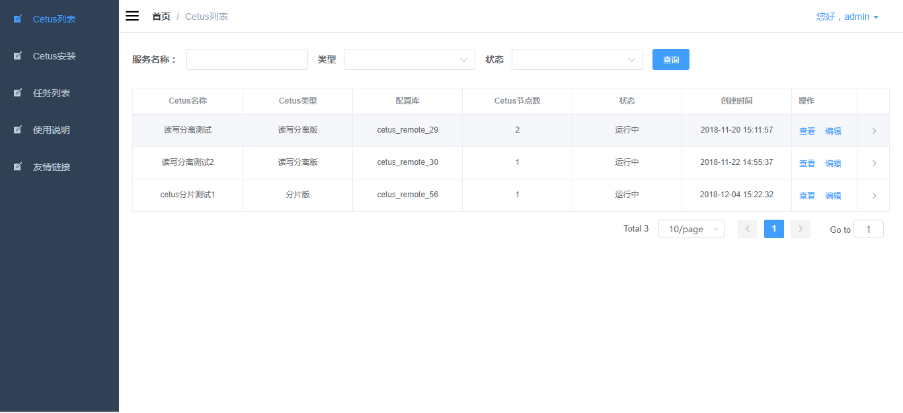
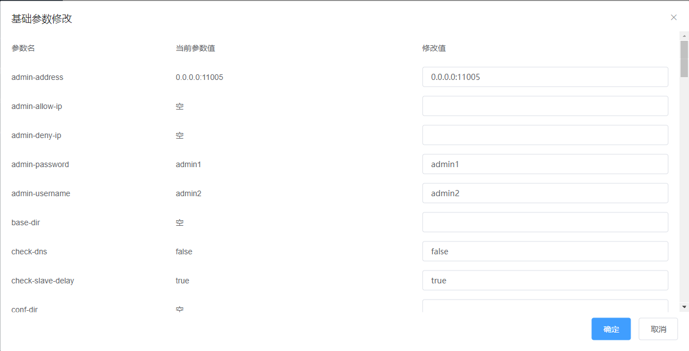
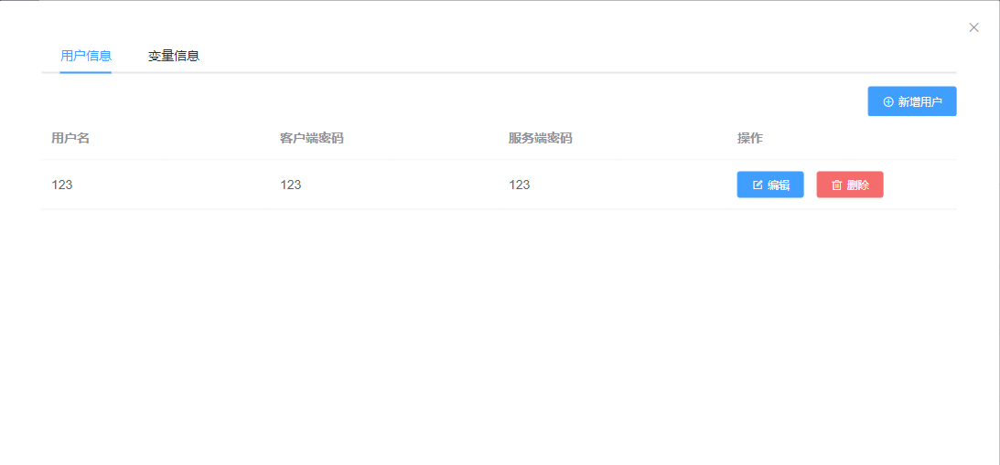
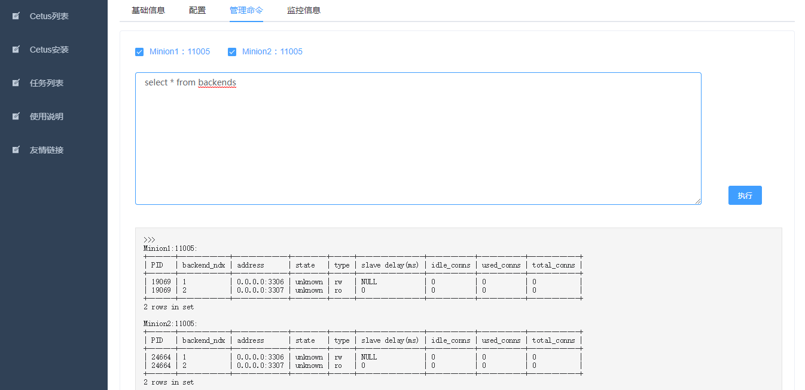
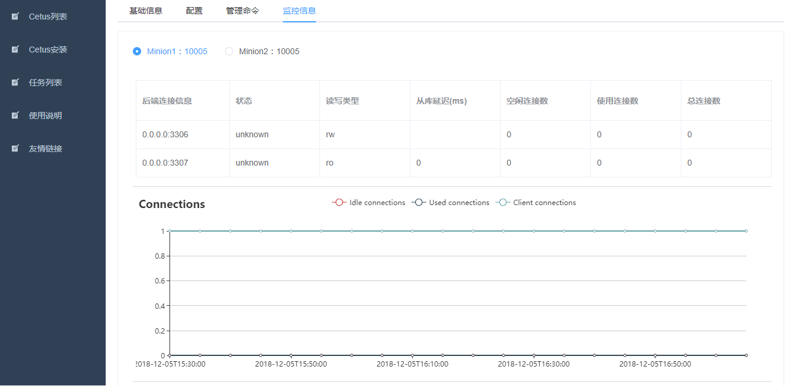
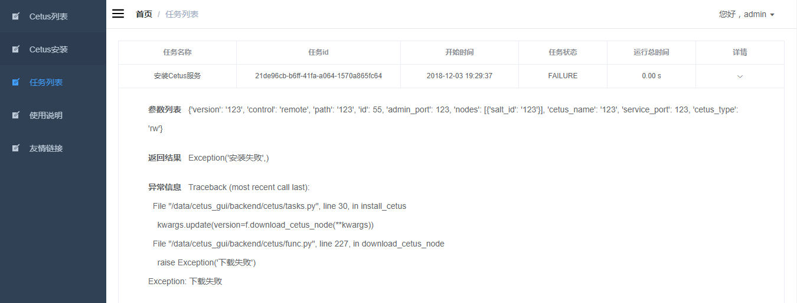

# Cetus-GUI 帮助文档

---

此文档主要是帮助您解决Cetus-GUI安装和使用过程中可能会出现的问题。

目前项目处于测试阶段，希望您在使用时能积极向我们反馈bug和需求，我们将会很快的解决。

---

### 环境部署

---

#### 基础环境配置

**所有与项目相关节点**确保有Python3环境，其中主节点兼容Python2环境以支持Supervisor。

**所有节点**确保执行下列命令：

* sudo yum install gcc gcc-c++ python3-devel python3-pip git
* sudo pip3 install pymysql


#### SaltStack安装

项目的应用依赖于配置好的SaltStack环境，请确保环境足够新以支持Python3 API。

以下是出现问题时可能的解决方案：

* 安装

    Master节点：
    * 项目当前**必须**与Master节点位于同一个服务器
    * 安装流程
        * sudo yum install https://repo.saltstack.com/py3/redhat/salt-py3-repo-latest-2.el7.noarch.rpm
        * sudo yum clean expire-cache
        * sudo yum install salt-master
        * sudo yum install salt-minion
        
    Minion节点：
    * Master节点所在服务器也可以配置为Minion
    * 安装流程
        * sudo yum install https://repo.saltstack.com/py3/redhat/salt-py3-repo-latest-2.el7.noarch.rpm
        * sudo yum clean expire-cache
        * sudo yum install salt-minion

* 配置

    Master节点：
    * 配置
    
    ```
      # sudo vi /etc/salt/master
      
      file_roots:
        base:
         - $PATH/backend/shells    # $PATH指项目所在路径
    ```
    
    * 启动
        * sudo service salt-master start

    Minion节点：
    * 配置
    
    ```
      # sudo vi /etc/salt/minion
      
      master: Master节点
      id: Minion唯一标识
    ```
    
    * 启动
        * sudo service salt-master start
        
* 非root用户启动

    在启动salt时可以修改启动用户，与整个项目的部署用户保持一致。**这一步是我们用非root用户部署项目时，必须要做的。**
    
    ```
      # sudo vi /etc/salt/master
          
      user: user
      
      # 修改权限
      # sudo chown -R user:user /etc/salt /var/cache/salt /var/log/salt /var/run/salt
      
      # sudo service salt-minion restart
    ```
    
    Minion节点不需要修改，这样可以使发送到Minion的命令仍为root执行。
        
* 其他问题

    如果有salt命令执行时报编码错误，极有可能是调用了Python2下的salt命令，请删除Python2配置环境下的SaltStack并安装Python3版本。
    
    pip3 install salt

---

### 项目部署

---

**本项目当前仅适用于RedHat/CentOS系统在SaltStack环境下使用远程配置库安装配置多Cetus节点的需求。**

部署环境上至少需要Python2和Python3双版本，需要**至少一个MySQL实例来放置项目数据库和Cetus配置数据库**。

**项目的配置方式详见README。**

以下是出现问题时可能的解决方案：

* 更新项目代码

    ```
    # git pull origin master
    # sh deploy.sh
    ```
    
* RabbitMQ问题

    * 可参考https://github.com/judasn/Linux-Tutorial/blob/master/markdown-file/RabbitMQ-Install-And-Settings.md
    
* 端口占用
    
    请确保以下端口未被占用
    * Django项目占用8000端口
    * Supervisor占用9001端口
    * SaltStack占用4505/4056端口
    * Vue项目占用9528端口
    
* 部署情况查询
    
    ```
    # supervisorctl
    backend                          RUNNING
    beat                             RUNNING
    celerycam                        RUNNING
    cetus                            RUNNING
    frontend                         RUNNING
    monitor                          RUNNING
    ```
    
    若有进程的状态非RUNNING，请查看deploy.sh的执行日志情况。
    
---

### 使用说明

---

* 登陆

    * 项目启动后，直接访问http://localhost:9528登陆系统。
    * 默认用户名与密码为admin/admin，可在Django端新增用户。
    
* 安装Cetus

    
    
    可以在SaltStack环境下的Minion节点安装Cetus，通过安装多节点可以配置Cetus端的负载均衡。
    
    提交安装请求后，若安装失败将在任务列表中显示对应log信息。
    
* Cetus列表

    
    
    显示所有Cetus运行或安装中的状态，点击查看可以查看Cetus详细信息，点击编辑可以修改Cetus基本信息。

* Cetus详情

    
    
    支持Cetus信息状态查询，节点的启动、关闭、更新、删除、新增等操作。

* Cetus配置

    
    
    支持Cetus基础参数的修改，用户与变量信息修改，分片信息修改，重启、更新、删除全部节点等功能。
    
    * 基础参数修改
    
        
        
        注意字体加粗的为静态参数，需要手动重启Cetus客户端才能生效。
    
    * 用户和变量信息修改
    
        
        
        其中用户名在Cetus端和MySQL端是一致的。密码分为客户端密码和服务端密码两种。
        客户端密码为客户端连接Cetus时的密码，服务端密码为Cetus端连接数据库的密码，两者可以不同。
        新增用户后也需要重启Cetus客户端来使信息生效。
        
    * 分片信息修改
    
        
        
        分片信息可在Cetus为分片版本时修改，具体的配置方式请参考https://github.com/Lede-Inc/cetus/blob/master/doc/cetus-shard-profile.md。
        
* Cetus管理命令

    
    
    支持直接在web端执行命令发送到Cetus管理端。
    
    具体支持的命令请参考：
    
    * 读写分离版：https://github.com/Lede-Inc/cetus/blob/master/doc/cetus-rw-admin.md
    * 分片版：https://github.com/Lede-Inc/cetus/blob/master/doc/cetus-shard-admin.md

* Cetus监控

    
    
    Cetus在默认安装完成后会自动部署脚本，每分钟收集一次监控信息。系统默认收集了backends信息，连接数信息，TPS/QPS信息等内容。

* 任务执行查询

    由于Master与Minion节点系统环境的不确定性，安装Cetus时会因各种情况报错，我们可以在任务列表中查看失败的任务。

    
    
    我们也可以直接查询应用日志定位问题，如果日志中的信息无法帮你准备定位并解决问题，请联系我们。
    
---

### 日志管理

---

在部署应用和安装配置Cetus过程中可能会存在各种报错，有些情况可能无法直接从网页端获取结果或解决方案，需要从后台日志中查询。

以下是应用程序和Cetus日志对应的位置。

* 应用日志

```
    cd $PATH/logs               # $PATH指项目所在路径   
    supervisor_backend.log      # Django日志  
    supervisor_beat.log          
    supervisor_celerycam.log    
    supervisor_cetus.log        # 后台任务日志
    supervisord.log             
    supervisor_frontend.log     
    supervisor_monitor.log      # Cetus监控日志  
```

* Cetus日志

```
    cd $CETUS_PATH/logs         # $CETUS_PATH指Cetus项目所在路径，默认为/home/cetus_服务端口号
    cetus.log                   # 运行日志
    xa.log                      # XA事务日志
    slowquery.log               # 慢日志
```
